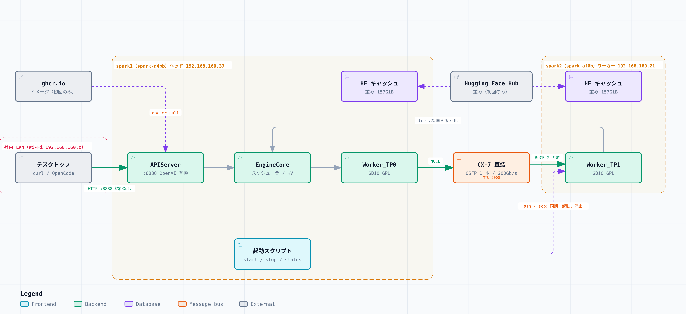

# DGX Spark 2 台で DeepSeek-V4-Flash を動かす

NVIDIA DGX Spark 2 台を ConnectX-7 で直結し、[DeepSeek-V4-Flash-Vision-Exp](https://huggingface.co/deepseek-ai/DeepSeek-V4-Flash-Vision-Exp) を vLLM のテンソル並列（TP=2）でローカルに動かしたときの手順と結果の記録である。
構築には [MiaAI-Lab/DeepSeek-v4-Flash-DSpark-2x-DGX-Spark](https://github.com/MiaAI-Lab/DeepSeek-v4-Flash-DSpark-2x-DGX-Spark) のレシピを使った。

- **作業期間**：2026-09-06 〜 2026-09-27
- **状態**：推論サーバが両ノードで稼働し、OpenAI 互換の API で応答を確認した

## 構成

| 呼び名 | ホスト名 | 役割 | 社内 LAN（管理用、Wi-Fi） | CX-7（2 系統） |
|---|---|---|---|---|
| spark1 | spark-a4bb | ヘッド（API サーバ、TP0） | 192.168.160.37 | 192.168.100.10 / 192.168.101.10 |
| spark2 | spark-af6b | ワーカー（TP1） | 192.168.160.21 | 192.168.100.11 / 192.168.101.11 |

- **ハードウェア**：NVIDIA DGX Spark × 2（GB10、統合メモリ 128GiB）、QSFP ケーブル 1 本で直結（200Gb/s、MTU 9000）
- **ソフトウェア**：DGX OS 7.6.0（Ubuntu 24.04.5 LTS）、NVIDIA ドライバ 580.178.04、CUDA 13.0
- **ランタイム**：`ghcr.io/anemll/dspark-vllm-gx10:0.1.1`（vLLM `0.25.2.dev0+g752a3a504`、NCCL 2.30.7）
- **モデル**：`deepseek-ai/DeepSeek-V4-Flash-Vision-Exp` @ `86f746b36186f0e567729a5c06a8c918caba82a9`

API リクエストが処理される流れは「[LLM の構築](docs/04-llm-deploy.md#リクエストが処理される流れ)」に図で示した。
図は拡大や検索ができる HTML 版（[構成図](diagrams/system-architecture.html)、[流れ図](diagrams/api-request-flow.html)）もある。
HTML 版は GitHub 上では表示されないので、ダウンロードしてブラウザで開く。

## 結果の要約

| 項目 | 結果 |
|---|---|
| RDMA 帯域（1 系統） | 109.17Gb/s（PCIe Gen5 x4 の上限 約 126Gb/s に対して） |
| NCCL all_reduce | busbw 21.4〜24.1GB/s（4GiB で約 193Gb/s、ライン レートの約 98%） |
| 重み | 157GiB、48 シャード、欠損 0（両機） |
| KV キャッシュ | 2,432,425 tokens（1M トークンのリクエストを同時に 2.32 本） |
| 起動時間（2 回目） | 約 4 分 35 秒 |
| 推論 | 956 トークンの生成に約 23 秒（1 リクエスト、`finish_reason: stop`） |

## 手順書

1. [初期セットアップ](docs/01-initial-setup.md)：OS、ハードウェア情報、ファームウェア、バージョン
2. [ノード間ネットワーク（ConnectX-7）](docs/02-network.md)：結線、netplan、ssh、RDMA 帯域
3. [NCCL による通信テスト](docs/03-nccl-test.md)：NCCL と nccl-tests のビルド、all_gather と all_reduce
4. [LLM の構築](docs/04-llm-deploy.md)：レシピの clone、`.env.dspark`、イメージ、重み、起動、動作確認
5. [運用](docs/05-operations.md)：起動と停止、状態確認、電源の切り方、API のエンドポイント
6. [トラブルシューティング](docs/06-troubleshooting.md)：構築中に起きた問題と対処
7. [チャット UI（Open WebUI）](docs/07-chat-ui.md)：複数人で使うチャット UI、同時実行数の制限、検証結果

設定ファイルは [configs/](configs/) に、チャット UI の設定は [app/open-webui/](app/open-webui/) にある。

## 表記

手順書の記述には、根拠の強さを示すラベルを付けている。

- **`[出典あり]`**：レシピや公式資料に記載がある。
- **`[推定]`**：ログや状況からの推定で、確認はしていない。
- **`[要検証]`**：試していない。

シェルのプロンプトは、実行したノードに合わせて `user@spark1:~$` と `user@spark2:~$` で示す。

## 残っている作業

- [ ] 推論中に RDMA の 2 系統（`rocep1s0f0` と `roceP2p1s0f0`）の両方にデータが流れているかを、`port_xmit_data` カウンタで確認する
- [ ] API の公開範囲を決める（ファイアウォールでの接続元の制限、API キーの設定）
- [ ] 管理用 IF を Wi-Fi から有線（`enP7s7`）に切り替える
- [ ] スループットを計測する（1 ストリームと並列 6）
- [ ] コーディングエージェント（OpenCode）から接続する
- [ ] 重みのライセンス条項を原文で確認する

## 謝辞

この環境は、[MiaAI-Lab/DeepSeek-v4-Flash-DSpark-2x-DGX-Spark](https://github.com/MiaAI-Lab/DeepSeek-v4-Flash-DSpark-2x-DGX-Spark)（commit `97e8733`）の手順とスクリプト（`prepare-dspark-model-cache.sh`、`start-deepseek-v4-flash-dspark.sh` など）をそのまま使って構築した。
DGX Spark 2 台で DeepSeek-V4-Flash を動かすための設定、パッチ、検証スクリプトを整備し、公開しているレシピの作者に感謝する。

手順書で引用している `.env.dspark.example` の変数名と設定例、スクリプトの出力は、レシピのものである。
レシピは MIT License（Copyright (c) 2026 Tony Deangelo）で公開されている。
このリポジトリにはレシピのスクリプトを含めていないので、レシピのリポジトリを clone して使う。

## 参考資料

- [MiaAI-Lab/DeepSeek-v4-Flash-DSpark-2x-DGX-Spark](https://github.com/MiaAI-Lab/DeepSeek-v4-Flash-DSpark-2x-DGX-Spark)
- [deepseek-ai/DeepSeek-V4-Flash-Vision-Exp](https://huggingface.co/deepseek-ai/DeepSeek-V4-Flash-Vision-Exp)
- [Anemll/dspark-vllm-gx10](https://github.com/Anemll/dspark-vllm-gx10)
- [NVIDIA dgx-spark-playbooks — NCCL for Multiple Sparks](https://github.com/NVIDIA/dgx-spark-playbooks/blob/main/nvidia/nccl/README.md)
- [NVIDIA dgx-spark-playbooks — Connect Two Sparks](https://github.com/NVIDIA/dgx-spark-playbooks/blob/main/nvidia/connect-two-sparks/README.md)
- [ConnectX-7 Networking — DGX Spark User Guide](https://docs.nvidia.com/dgx/dgx-spark/spark-clustering.html)
- [ConnectX-7 throughput drops to 25 Gbps after hot-plug（NVIDIA Developer Forums）](https://forums.developer.nvidia.com/t/connectx-7-throughput-drops-to-25-gbps-after-hot-plug-cable-reconnection-on-gigabyte-gb10-ai-top-atom/371031)

## ライセンス

[MIT License](LICENSE)
