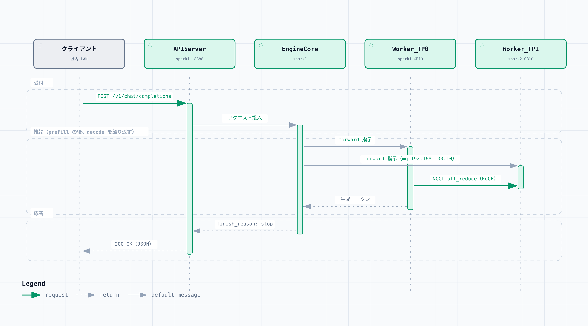

# 4. LLM の構築

[MiaAI-Lab/DeepSeek-v4-Flash-DSpark-2x-DGX-Spark](https://github.com/MiaAI-Lab/DeepSeek-v4-Flash-DSpark-2x-DGX-Spark)（以下レシピ）を使い、2 台の DGX Spark で DeepSeek-V4-Flash-Vision-Exp を vLLM（TP=2）で動かす。
手順の詳細と各設定の意味はレシピの README を正とし、この章では実際に行った作業と結果を記録する。
WebFetch などで取得した README は古い内容のことがあるので、clone したリポジトリの README を読む。

| 項目 | 値 |
|---|---|
| レシピ | commit `97e8733`（2026-09-16） |
| ランタイムイメージ | `ghcr.io/anemll/dspark-vllm-gx10:0.1.1@sha256:a83948492cf13df455170fb42885f5ef4db54fefe0feff0f841ecbff464ac9d8` |
| モデル | `deepseek-ai/DeepSeek-V4-Flash-Vision-Exp` @ `86f746b36186f0e567729a5c06a8c918caba82a9`（公式重み、`ABLITERATED=0`） |
| 提供モデル名 | `deepseek-v4-flash-vision-exp`（クライアントが `model` に指定する名前） |
| 並列化 | vLLM TP=2（2 ノード × 1 GPU） |

レシピはこのモデルを「0731」と呼んでいることがある。

## Step 0：事前確認（両機）

earlyoom を無効化する。
長いコンテキストの負荷で vLLM が kill されるのを防ぐためで、レシピが明記している `[出典あり]`。

```
user@spark1:~$ sudo systemctl disable --now earlyoom 2>/dev/null; systemctl is-active earlyoom
inactive
```

ディスクの空きを確認する。
重みは約 157GiB あり、両機それぞれにダウンロードする。

```
user@spark1:~$ df -h ~/.cache/
Filesystem      Size  Used Avail Use% Mounted on
/dev/nvme0n1p2  3.7T   38G  3.5T   2% /
```

docker をユーザー権限で使えるようにする。

```bash
sudo usermod -aG docker $USER
newgrp docker                  # 今のシェルだけに反映される。恒久的にはログインし直す
docker run --rm hello-world
ssh spark2 'hostname && docker --version'
```

## Step 1：レシピの clone（両機）

両機の同じパス（`~/work/DeepSeek-v4-Flash-DSpark-2x-DGX-Spark`）に clone し、コミットを固定する。
同じパスにしておくと、ワーカー側のディレクトリを設定する必要がない。

```bash
mkdir -p ~/work && cd ~/work
git clone https://github.com/MiaAI-Lab/DeepSeek-v4-Flash-DSpark-2x-DGX-Spark.git
cd DeepSeek-v4-Flash-DSpark-2x-DGX-Spark && git checkout 97e8733

ssh spark2 'mkdir -p ~/work && cd ~/work && git clone https://github.com/MiaAI-Lab/DeepSeek-v4-Flash-DSpark-2x-DGX-Spark.git && cd DeepSeek-v4-Flash-DSpark-2x-DGX-Spark && git checkout 97e8733'
```

以降の操作は、spark1 のこのディレクトリで行う。

## Step 2：`.env.dspark` の作成（spark1 のみ）

example をコピーし、この環境に合わせて書き換える。
変更した値だけを [configs/env.dspark.changes](../configs/env.dspark.changes) にまとめた。

```bash
cp .env.dspark.example .env.dspark
chmod 600 .env.dspark          # HF_TOKEN などの秘密情報を含むため
```

| 変数 | 値 | 理由 |
|---|---|---|
| `WORKER_HOST` / `WORKER_VLLM_HOST_IP` | 192.168.100.11 | spark2 の CX-7 側 IP |
| `MASTER_ADDR` / `VLLM_HOST_IP` | 192.168.100.10 | spark1 の CX-7 側 IP |
| `NCCL_IB_HCA` | `=rocep1s0f0,roceP2p1s0f0` | 2 系統を完全一致で指定する。1 系統だとポートの半分の帯域になるとレシピに実測の記載がある `[出典あり]` |
| `NCCL_SOCKET_IFNAME` / `TP_SOCKET_IFNAME` / `GLOO_SOCKET_IFNAME` | `enp1s0f0np0` | example の `TP_` と `GLOO_` は f1 側（`enp1s0f1np1`）になっているので、f0 側に変える |
| `VLLM_HOST` | `0.0.0.0` | 別のマシンから API を使うため（後述の注意を参照） |
| `HF_TOKEN` | 各自のトークン | ダウンロード時のレート制限を避けるため |

`NCCL_IB_HCA==rocep1s0f0,roceP2p1s0f0` のように `=` が 2 つ続くのは誤記ではない。
先頭の `=` が完全一致指定を表す NCCL の書式である `[出典あり]`。
example には `NCCL_IB_HCA=rocepXsYfZ` という行があるので、書き換えるか削除して、`NCCL_IB_HCA` の行が 1 つだけになるようにする。

両機のポート名が同じ（f0）なので、`WORKER_NCCL_*` は設定しない。
`MAX_MODEL_LEN`、`MAX_NUM_SEQS`、`GPU_MEMORY_UTILIZATION_TEXT`、`DEFAULT_THINKING` などは example の既定値（1M / 6 / 0.835 / `low`）のままにする。
レシピの README に、意図がない限り既定値を変えないよう書かれている `[出典あり]`。

### `VLLM_HOST` についての注意

最初は `VLLM_HOST=127.0.0.1` にして spark1 の中からだけアクセスし、動作を確認してから、別のデスクトップマシンから API を使うために `0.0.0.0` へ変えた。
`0.0.0.0` にすると、`:8888` は認証なしで LAN に公開される。
起動スクリプトも次の警告を出す。

```
WARN: serving an UNAUTHENTICATED API on 0.0.0.0:8888 (host network).
      Anyone who can route to this address gets full inference. Set VLLM_API_KEY or
      DSPARK_API_KEYS in .env.dspark — and note /invocations, /tokenize, /metrics stay
      keyless on the pinned runtime, so restrict the port at the network layer too —
      or bind 127.0.0.1 for head-only access. See .env.dspark.example (VLLM_API_KEY).
```

`DSPARK_API_KEYS`（または `VLLM_API_KEY`）を設定すると、vLLM に `--api-key` が渡される。
ただし `/invocations`、`/tokenize`、`/metrics` は API キーの対象外なので、ファイアウォールで接続元を絞るなど、ネットワーク側の制限もあわせて行う。
この環境では API キーを設定していない。

### 設定の検証

```bash
grep -nE 'f1np1|rocep1s0f1' .env.dspark | grep -v '^\s*[0-9]*:#'   # 何も出なければ OK
./validate-dspark-config.sh
bash scripts/ci-validate.sh                                        # GPU を使わない静的チェック
```

`validate-dspark-config.sh` は、解決した設定と vLLM の起動コマンドを表示する。
主な値は次のとおりである。

```
DSpark config:
  worker: 192.168.100.11
  master: 192.168.100.10:25000
  image: ghcr.io/anemll/dspark-vllm-gx10:0.1.1@sha256:a83948492cf13df455170fb42885f5ef4db54fefe0feff0f841ecbff464ac9d8
  checkpoint: deepseek-ai/DeepSeek-V4-Flash-Vision-Exp (ABLITERATED=0)
  revision: 86f746b36186f0e567729a5c06a8c918caba82a9
  served model: deepseek-v4-flash-vision-exp
  max model len: 1048576
  max num seqs: 6
  max batched tokens: 8192
  gpu memory utilization: 0.835 (GPU_MEMORY_UTILIZATION_TEXT=0.835)
  spec tokens (MTP_NUM_TOKENS): 6 with draft_sample_method=probabilistic (Vision-Exp: >=5 and divisible by 3)
  host bind: 0.0.0.0
```

起動コマンドは長いので、主要なオプションだけを抜き出す。

```
vllm serve deepseek-ai/DeepSeek-V4-Flash-Vision-Exp --revision 86f746b36186f0e567729a5c06a8c918caba82a9
  --served-model-name deepseek-v4-flash-vision-exp --host 0.0.0.0 --port 8888
  --tensor-parallel-size 2 --pipeline-parallel-size 1 --nnodes 2 --node-rank 0
  --master-addr 192.168.100.10 --master-port 25000
  --kv-cache-dtype nvfp4_ds_mla --block-size 256 --max-model-len 1048576
  --max-num-seqs 6 --max-num-batched-tokens 8192 --gpu-memory-utilization 0.835
  --enable-prefix-caching --enable-chunked-prefill --async-scheduling
  --speculative-config '{"method":"dspark","num_speculative_tokens":6,"draft_sample_method":"probabilistic"}'
  --tokenizer-mode deepseek_v4 --tool-call-parser deepseek_v4 --enable-auto-tool-choice
  --reasoning-parser deepseek_v4 --default-chat-template-kwargs '{"thinking":true,"reasoning_effort":"low"}'
```

`scripts/ci-validate.sh` は最終行で判定する。

```
CI validate passed (CPU recipe gates only).
```

出力の途中に `[FAIL]` を含む行がいくつか出るが、それらのテストはいずれも `OK` で終わっている。
失敗する入力を与えて、パッチが安全に失敗することを確かめるテストのメッセージである。

## Step 3：ランタイムイメージの pull（両機）

```bash
IMG=$(grep '^DSPARK_VLLM_IMAGE=' .env.dspark | cut -d= -f2-)
docker pull "$IMG"
ssh spark2 "docker pull '$IMG'"
```

digest で指定しているので、両機で同じイメージになる。
起動スクリプトは、片方にイメージがなければ起動を拒否する `[出典あり]`。
イメージは 18.8GB あり、この環境では pull に 1〜2 時間かかった。

digest 指定で pull したイメージは `docker images` でタグなしと表示される。
見分けやすいようにタグを付けた。

```
$ docker tag 3430d6614a8e ghcr.io/anemll/dspark-vllm-gx10:0.1.1
$ docker images
IMAGE                                   ID             DISK USAGE   CONTENT SIZE   EXTRA
ghcr.io/anemll/dspark-vllm-gx10:0.1.1   3430d6614a8e       18.8GB             0B
```

## Step 4：重みのダウンロード

Hugging Face で読み取り専用のアクセストークンを作り、`.env.dspark` の `HF_TOKEN=` に設定しておく。
公式の重みは同意の手続きがなく、トークンは必須ではない。
ただしトークンがないと、レート制限の警告が出てダウンロードが遅くなる。

SSH が切れても止まらないように tmux の中で実行する。

```bash
tmux new -s prepare
./prepare-dspark-model-cache.sh --official
```

既定の `DSPARK_WORKER_HF_NFS=0` では、ワーカーでも同じ重みを個別にダウンロードする（約 157GiB × 2）。
スクリプトは設定ファイルだけをワーカーへ scp し、重みは各ノードが Hugging Face から取得する `[出典あり]`。

```
prepare: Hugging Face token: set (from .env.dspark; redacted)
prepare: ABLITERATED=0 → deepseek-ai/DeepSeek-V4-Flash-Vision-Exp @ 86f746b36186f0e567729a5c06a8c918caba82a9
Fetching 82 files: 100%|██████████| 82/82 [4:22:02<00:00, 191.74s/it]
snapshot=/cache/huggingface/hub/models--deepseek-ai--DeepSeek-V4-Flash-Vision-Exp/snapshots/86f746b36186f0e567729a5c06a8c918caba82a9
revision=86f746b36186f0e567729a5c06a8c918caba82a9
safetensor_shards=48
missing_shards=0
```

この環境では、ヘッドのダウンロードに約 4 時間 22 分かかった（Wi-Fi 経由）。
ワーカーの所要時間は記録していない。
進捗は次のコマンドで確認できる。

```bash
watch -n 60 'du -sh ~/.cache/huggingface/hub/models--deepseek-ai--DeepSeek-V4-Flash-Vision-Exp; ssh spark2 du -sh ~/.cache/huggingface/hub/models--deepseek-ai--DeepSeek-V4-Flash-Vision-Exp 2>/dev/null'
```

ダウンロードの並列数は `HF_DOWNLOAD_WORKERS`（既定 1）で変えられるが、効果は回線の容量に左右される。
回線が遅い場合は、速い回線につないだマシンで外付け SSD に `hf download --local-dir` し、SSD から各ノードへコピーしてハッシュを照合する方法も考えられる `[要検証]`。

ダウンロードのあとは、`HF_HUB_OFFLINE=1`（example の既定値）のまま運用する。

## Step 5：起動と動作確認

起動前に設定と空きメモリを確認する。
この環境で実行したときは example の `NCCL_IB_HCA=rocepXsYfZ` の行が残っていたので、下の出力はその行を除いた状態で示す。

```
$ grep -E '^(HF_HUB_OFFLINE|VLLM_HOST|NCCL_IB_HCA|NCCL_SOCKET_IFNAME|TP_SOCKET_IFNAME|GLOO_SOCKET_IFNAME|ABLITERATED)=' .env.dspark
NCCL_SOCKET_IFNAME=enp1s0f0np0
TP_SOCKET_IFNAME=enp1s0f0np0
GLOO_SOCKET_IFNAME=enp1s0f0np0
HF_HUB_OFFLINE=1
ABLITERATED=0
VLLM_HOST=0.0.0.0
NCCL_IB_HCA==rocep1s0f0,roceP2p1s0f0

$ free -h
               total        used        free      shared  buff/cache   available
Mem:           121Gi       5.1Gi       1.5Gi       7.2Mi       116Gi       116Gi
```

起動する。
スクリプトは設定とパッチをワーカーへ同期し、ワーカー、ヘッドの順にコンテナを起動して、API が応答するまで待つ。

```bash
./start-deepseek-v4-flash-dspark.sh
```

初回は JIT コンパイルに数分以上かかるので、途中で再起動せずにヘルスチェックを待つ `[出典あり]`。
初回の所要時間は記録していない。
2 回目の起動では、API サーバの起動から待受開始まで約 4 分 35 秒かかった。

| 段階 | spark1（TP0） | spark2（TP1） |
|---|---|---|
| 重みの読み込み（各ランク 80.04 GiB） | 約 221 秒 | 約 155 秒 |
| エンジンの初期化（プロファイル、KV キャッシュ作成、ウォームアップ） | 25.78 秒 | （同上） |

起動ログで、両ランクの RDMA デバイスが 2 つとも RoCEv2 の GID に解決されていることを確認できる。

```
Validating RoCEv2 GIDs from sysfs (head if=enp1s0f0np0 ip=192.168.100.10 selector==rocep1s0f0,roceP2p1s0f0; worker if=enp1s0f0np0 ip=192.168.100.11 selector==rocep1s0f0,roceP2p1s0f0)...
  member roceP2p1s0f0:1 -> RoCEv2 gid index 3 (via own-addr 192.168.101.10 on enP2p1s0f0np0)
  member rocep1s0f0:1 -> RoCEv2 gid index 3 (via match-ip 192.168.100.10)
  member roceP2p1s0f0:1 -> RoCEv2 gid index 3 (via own-addr 192.168.101.11 on enP2p1s0f0np0)
  member rocep1s0f0:1 -> RoCEv2 gid index 3 (via match-ip 192.168.100.11)
RoCEv2 GIDs validated on both ranks; NCCL_IB_GID_INDEX left unset so NCCL selects the RoCEv2/IPv4 GID per HCA.
```

これは 2 系統を使う設定になっていることの確認であり、推論中に両系統へ実際にデータが流れているかは確認していない。

### API の確認

```
$ curl -fsS http://127.0.0.1:8888/v1/models | jq '.data[0] | {id, root, max_model_len}'
{
  "id": "deepseek-v4-flash-vision-exp",
  "root": "deepseek-ai/DeepSeek-V4-Flash-Vision-Exp",
  "max_model_len": 1048576
}

$ ./smoke-deepseek-v4-flash-dspark.sh
Running 6-way smoke test against http://127.0.0.1:8888/v1/chat/completions
Smoke test passed: 6/6 requests succeeded.
```

`./status-deepseek-v4-flash-dspark.sh` で、両ノードのコンテナが `Up (healthy)` で、イメージ ID（`sha256:3430d6614a8e…`）が一致していることを確認する。

### KV キャッシュ

起動ログの KV キャッシュの値は、既定の `logs-…sh` では表示範囲から外れるので、`TAIL=all` で全体を取得する。

```bash
TAIL=all ./logs-deepseek-v4-flash-dspark.sh 2>&1 | grep -E 'Available KV cache|GPU KV cache size|Maximum concurrency'
```

| ログの項目 | 初回の起動 | 2 回目の起動 | レシピ作者の環境 `[出典あり]` | 意味 |
|---|---|---|---|---|
| `Available KV cache memory`（TP0 / TP1） | 16.62 / 14.92 GiB | 16.52 / 16.38 GiB | 17.04 GiB | 重みなどを除いて KV キャッシュに使えるメモリ（ランクごと） |
| `GPU KV cache size` | 2,215,691 tokens | 2,432,425 tokens | 2,331,430 tokens | クラスタ全体の KV キャッシュの容量（全リクエストのトークンの合計の上限） |
| `Maximum concurrency for 1,048,576 tokens` | 2.11x | 2.32x | 2.22x | 1M トークンのリクエストを同時に何本入れられるか |

レシピの README にも、この値は環境ごとに変わるので実際の起動ログの値を信じるよう書かれている `[出典あり]`。
初回は spark2 の値が約 1.7GiB 少なかったが、2 回目は差が約 0.14GiB まで縮んだ。
初回の差は、起動時のページキャッシュや常駐プロセスによる空きメモリの違いだった可能性がある `[推定]`。

### 推論の確認

```
$ time curl -s http://127.0.0.1:8888/v1/chat/completions \
  -H 'Content-Type: application/json' -d '{
  "model": "deepseek-v4-flash-vision-exp",
  "messages": [{"role": "user", "content": "Goで context.WithTimeout の使い方を短く説明して"}],
  "max_tokens": 2048,
  "temperature": 0
}' | jq '{finish: .choices[0].finish_reason, usage: .usage}'
{
  "finish": "stop",
  "usage": {
    "prompt_tokens": 17,
    "total_tokens": 973,
    "completion_tokens": 956
  }
}

real    0m23.210s
```

`finish_reason` が `stop` で、`content` に日本語の説明が返れば正常である。
この 1 回のリクエストは、spark1 の上から `127.0.0.1` に送って測った。

### リクエストが処理される流れ

別のマシンから `POST /v1/chat/completions` を送ったときの流れを図に示す。
プロセス名は起動ログに出る名前である。



1. spark1 の `APIServer` がリクエストを受け、`EngineCore` に渡す。
2. `EngineCore` がスケジューリングと KV キャッシュの割り当てを行い、spark1 の `Worker_TP0` と spark2 の `Worker_TP1` に計算を指示する。
   spark2 への指示は、CX-7 側の IP（`192.168.100.10`）のメッセージキューを経由する。
3. 2 つのワーカーは、prefill と decode の各ステップで、計算結果を NCCL の all_reduce で交換する（CX-7 の RoCE 経由）。
   decode では DSpark の投機的デコードにより、1 回に最大 6 トークンの候補を出して検証する（`num_speculative_tokens: 6`）。
4. 生成が終わると、`APIServer` が JSON で応答を返す。
   `"stream": true` を指定した場合は、トークンを SSE で順次返す。
